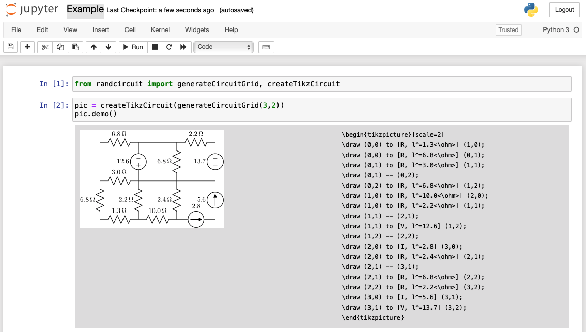

# Let's get some random circuits!

Usage:

Install:

check out this repo, then 

pip install -e .

Requirements: 
	[randresist](https://github.com/sspickle/randresist)
	[pytikz](https://github.com/allefeld/pytikz)

